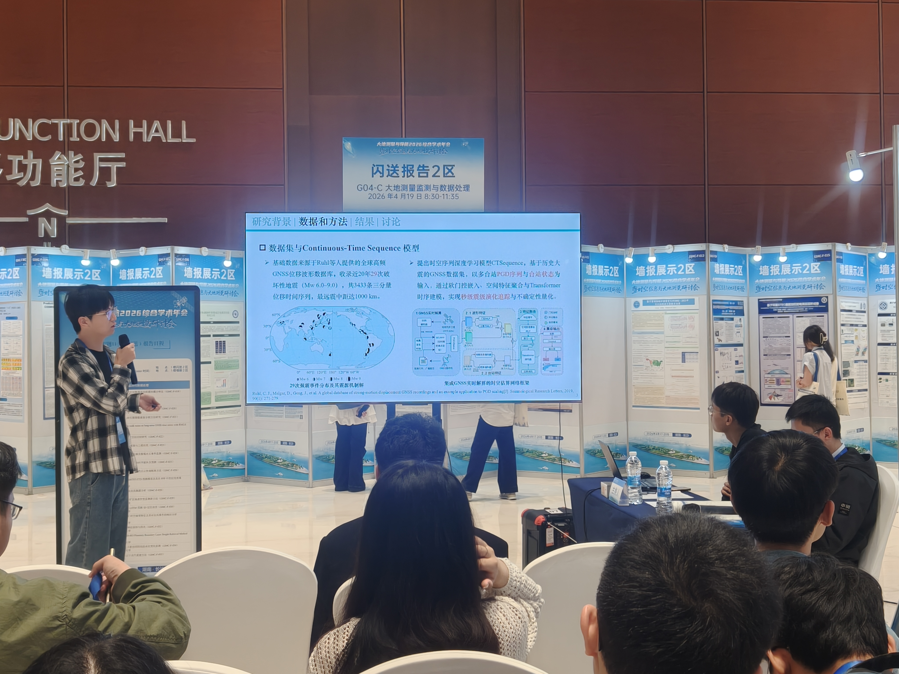

This page records my participation in the **2026 Symposium on Spatiotemporal Information and Geodesy**, held in Changsha, China, from April 17 to April 20, 2026. I presented this work in a lightning presentation format, combining a short oral presentation with a poster session.

## Event Overview

- Event: 2026 Symposium on Spatiotemporal Information and Geodesy
- Date: April 17–20, 2026
- Location: Changsha, China
- Format: lightning presentation, including a short oral presentation and poster display
- Poster title: Rapid Magnitude Estimation Using BeiDou-3 PPP-B2b Coseismic Displacements and Deep Learning: Case Studies of the 2025 Dingri Mw 7.1 and Mandalay Mw 7.7 Earthquakes

## Summary

China is located at the convergence of multiple tectonic plates and faces long-term seismic hazard risks. Existing earthquake early warning systems rely heavily on cloud-based communication, which may become unreliable when major earthquakes damage critical infrastructure. High-rate GNSS observations are non-saturating and do not accumulate errors, enabling direct measurement of coseismic displacement. The BeiDou-3 PPP-B2b service broadcasts correction messages through GEO satellites without requiring internet access, providing unique support for real-time high-precision positioning on edge devices.

This study proposes CTSequence (Continuous-Time Sequence), a spatiotemporal sequence deep learning model for second-level rapid magnitude estimation based on PPP-B2b real-time observation streams. The generalization performance and robustness of the approach are evaluated using the 2025 Tibet Dingri Mw 7.1 and Myanmar Mandalay Mw 7.7 earthquakes.

## Takeaways

- Presented preliminary progress on PPP-B2b real-time positioning and deep-learning-based rapid magnitude estimation through a lightning talk and poster.
- Discussed the work with researchers and students in spatiotemporal information, geodesy, and seismic monitoring.
- Future work will further improve the edge-side real-time processing workflow, model evaluation, and cross-event generalization tests.

## Photos

