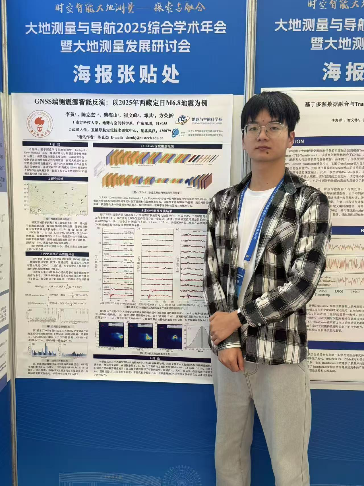

本海报聚焦“实时 GNSS 与地震监测”的端侧一体化方案，围绕以下要点：

- 研究动机：利用 GNSS 抗饱和优势进行快速位移/量级评估
- 数据与改正：接入 RTPPP 实时流，融合 PPP-B2b/精密改正
- 方法设计：时序特征工程 + 轻量模型，实现在线检测与估计
- 实验与案例：多台站与历史事件的延迟与鲁棒性评估
- 工程实践：接入、清洗、推理、可视化与结果发布

## 海报摘要
本海报围绕“实时 GNSS 与地震监测”的端侧一体化方案，聚焦在动态数据流场景下的低延迟、鲁棒的震源检测与参数估计。
- 研究动机：在地震预警与震后评估中，利用 GNSS 的抗饱和优势进行快速量级/位移评估。
- 数据与改正：接入 RTPPP 实时流，融合 PPP-B2b/精密改正，提高稳定性与时效性。
- 方法设计：结合时序特征工程与轻量模型，实现端侧在线检测与估计。
- 实验与案例：在多台站数据与若干历史事件上验证延迟、鲁棒性与跨事件泛化。
- 工程实践：端到端链路覆盖接入、清洗、推理、可视化与结果发布。

## 主要贡献
- 提出面向实时流的 GNSS 端侧检测。
- 在多场景评测中展示低延迟与稳健性。
- 给出可复用的工程实现与部署要点。

## 方法流程概览
1. 数据接入：RTPPP 实时流 + PPP-B2b/精密改正
2. 预处理：质量控制、漂移/基线修正、噪声抑制
3. 特征与检测：时序/频域特征 + 轻量检测模型
4. 估计与校正：震源参数估计 + 物理一致性校正
5. 输出与展示：结果推送、可视化与不确定性

## 海报图

